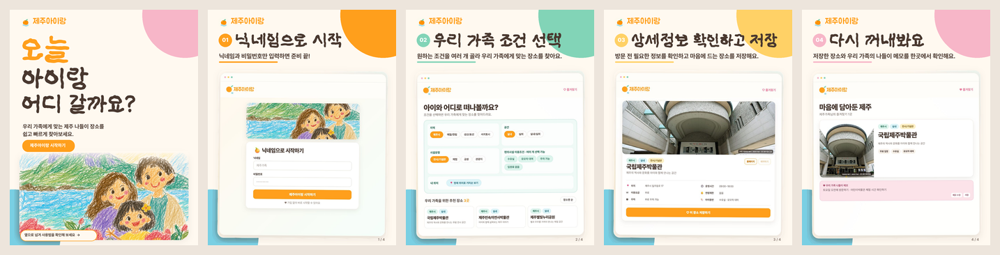

# 🍊 제주아이랑

> 아이와 함께 갈 제주 나들이 장소를 우리 가족의 조건에 맞춰 찾아보세요.

## 제주아이랑은 어떤 서비스인가요?

아이와 함께 외출할 장소를 고를 때는 생각보다 확인할 것이 많습니다.

수유실이나 기저귀 교환대가 있는지, 유모차를 빌릴 수 있는지, 비가 와도 갈 수 있는 실내 공간인지, 주차는 가능한지 여러 사이트를 오가며 찾아봐야 합니다.

**제주아이랑**은 제주에서 아이와 함께 갈 만한 장소와 가족 편의 정보를 한곳에 모아, 우리 가족에게 맞는 나들이 장소를 쉽고 빠르게 찾을 수 있도록 만든 서비스입니다.

## 이런 분께 추천해요

- 아이와 함께 제주 나들이를 계획하는 가족
- 수유실, 유모차 대여 등 아이 동반 편의시설을 미리 확인하고 싶은 분
- 비 오는 날 갈 수 있는 실내 장소를 찾는 분
- 마음에 드는 장소를 저장하고 나만의 목록으로 정리하고 싶은 분
- 제주 여행 중 현재 위치에서 가까운 가족 여행지를 찾는 분

## 주요 기능

### 🔍 우리 가족에게 맞는 장소 찾기

지역, 실내·실외, 시설유형과 다양한 편의시설 조건을 선택해 원하는 장소를 찾을 수 있습니다.

- 장소명 검색
- 제주 지역별 검색
- 실내·실외 공간 선택
- 입장료와 연령제한 여부 확인
- 수유실, 유모차 대여, 기저귀 교환대 확인
- 주차와 제주도민 할인 정보 확인

### 🗺️ 원하는 방식으로 둘러보기

검색한 장소를 갤러리, 표, 지도 중 편한 방식으로 확인할 수 있습니다. 위치 사용을 허용하면 현재 위치에서 가까운 장소부터 살펴볼 수도 있습니다.

> 현재 위치는 거리 계산에만 사용되며 별도로 저장되지 않습니다.

### 📌 방문 전 필요한 정보 확인하기

장소 상세 화면에서 아이와 방문하기 전에 필요한 정보를 한눈에 확인할 수 있습니다.

- 주소와 운영시간
- 이용 요금과 연령제한
- 주차 가능 여부
- 아이 동반 편의시설
- 홈페이지와 예약 페이지
- 비슷한 장소 추천

운영시간과 이용 요금은 변경될 수 있으므로 방문 전 해당 장소의 공식 홈페이지에서 최신 정보를 확인해 주세요.

### ❤️ 마음에 드는 장소 저장하기

별도의 회원가입 없이 닉네임과 비밀번호만 입력하면 마음에 드는 장소를 저장할 수 있습니다.

- 나만의 카테고리 만들기
- 장소별 메모 남기기
- 저장한 장소를 갤러리와 지도에서 확인하기
- 내 즐겨찾기 목록을 CSV 파일로 내려받기

## 이용 방법

1. 닉네임과 비밀번호를 입력하고 시작합니다.
2. 가고 싶은 지역과 우리 가족에게 필요한 조건을 선택합니다.
3. 검색 결과에서 장소의 사진과 주요 정보를 확인합니다.
4. 마음에 드는 장소를 저장하고 카테고리와 메모로 정리합니다.

## 현재 제공하는 정보

현재 제주 지역의 관광지, 체험 공간, 박물관, 공연·문화시설 등 **260곳**의 정보를 제공하고 있습니다.

장소마다 다음과 같은 정보를 확인할 수 있습니다.

- 지역과 도로명 주소
- 실내·실외 여부와 시설유형
- 운영시간과 휴무일
- 입장료와 연령제한
- 주차 및 아이 동반 편의시설
- 홈페이지, 예약 링크, 장소 사진

## 현재의 한계

- 아직 사용자 이용 데이터를 바탕으로 한 **인기순 정렬 기능은 제공하지 않습니다.**
- 장소에 따라 사진, 운영시간, 편의시설 등 일부 정보가 비어 있을 수 있습니다.
- 외부 사정에 따라 운영시간과 요금 등의 정보가 실제와 다를 수 있습니다.

## 향후 계획

- 부족한 장소 사진과 가족 편의시설 정보를 지속적으로 보강할 예정입니다.
- 사용자 이용 데이터를 바탕으로 인기 있는 장소를 쉽게 찾을 수 있는 기능을 추가할 계획입니다.
- 제주에서 시작해 **전국의 아이 동반 장소를 찾을 수 있는 서비스로 확대**할 계획입니다.

