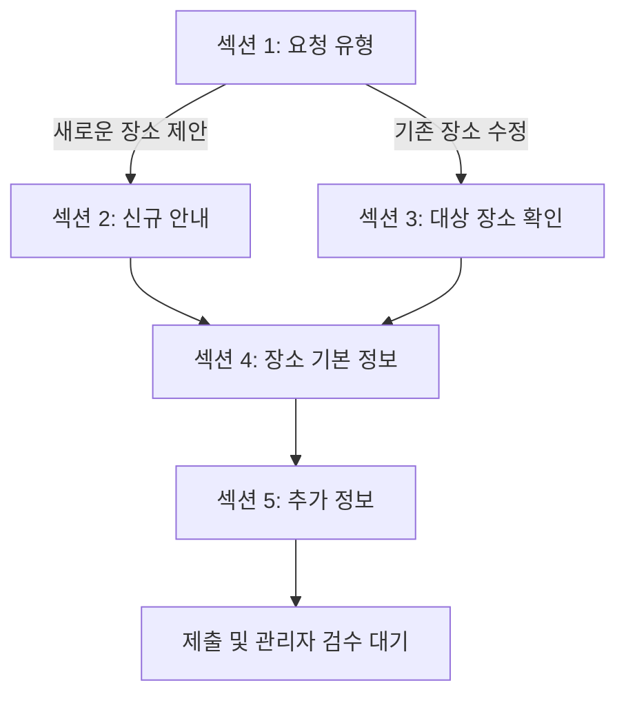

# 제주아이랑 장소 제안·수정 Google Form 설계

작성일: 2026-07-17  
기준 문서: `docs/data_update_design.md`  
기준 데이터: `data/jeju-irang.csv`

> **2026-07-17 변경 결정:** 현재 운영 데이터의 장소명이 중복되지 않으므로 Form에서 `수정 대상 장소 ID`를 받지 않는다. 사용자는 `기존 장소명`만 필수 입력하며, 관리자가 승인 데이터를 반영할 때 정규화된 장소명이 정확히 한 건 일치하는지 확인하여 내부 `place_id`를 결정한다. 이 문서 아래에 남아 있는 `target_place_id` 입력 관련 설명보다 이 결정이 우선한다.

> **2026-07-17 API 변경:** 장소 후보 검색은 VWorld 검색 API 2.0을 사용한다. 위치 단서 질문은 카카오맵 URL을 받지 않고 주소 또는 동네 힌트만 선택적으로 받는다. 아래의 카카오맵 URL 및 카카오 장소 검색 관련 설명보다 이 결정이 우선한다.

## 1. 설계 결론

- Google Form은 **하나만** 사용한다.
- 첫 질문인 `요청 유형`에서 `새로운 장소 제안`과 `기존 장소 수정`을 선택하고, 응답에 따라 서로 다른 섹션으로 이동한다.
- 신규 제안과 수정 요청 모두 장소의 현재 상태를 파악하는 데 필요한 핵심 질문을 작성한다.
- 수정 요청은 `target_place_id`를 기준으로 기존 행을 찾는다. 장소명은 사람이 교차 확인하기 위한 보조값이다.
- 수정 요청에는 `수정할 항목` 질문을 둔다. 필수 질문에 답했더라도, 실제 CSV 갱신은 `수정할 항목`에서 선택한 컬럼만 대상으로 한다.
- 빈 선택 질문은 신규 등록에서는 빈 값으로 저장할 수 있지만, 수정 요청에서는 **기존 값을 삭제하지 않는다**.
- Form 응답은 곧바로 운영 CSV에 반영하지 않는다. 관리자가 검수하여 승인한 응답만 후속 처리 단계에서 반영한다.

### 카카오맵 URL과 주소 힌트에 대한 결정

`카카오맵 장소 URL`과 `주소 또는 동네 힌트`를 별도 질문으로 모두 받는 것은 응답 부담이 크다. 하지만 장소명만으로는 동명이거나 카카오 검색 결과가 여러 개인 장소를 확정하기 어려울 수 있으므로 위치 단서를 완전히 없애지는 않는다.

두 질문을 다음 질문 하나로 합친다.

> **장소를 찾는 데 도움이 되는 정보**  
> 카카오맵 장소 URL 또는 주소·동네 힌트 중 아는 내용을 입력해 주세요.  
> 예: `https://place.map.kakao.com/...` 또는 `제주시 애월읍`

- 필수 여부: 선택
- 신규 제안에서 입력 권장
- 수정 요청은 `target_place_id`가 있으므로 보통 생략 가능
- 이 값은 운영 CSV 컬럼이 아니라 검수용 `location_hint`로 저장한다.
- 값이 없고 카카오 검색 결과가 여러 개이거나 없는 경우에만 관리자가 `추가 정보 필요` 상태로 전환한다.

## 2. Form 기본 정보

| 항목 | 권장값 |
|---|---|
| Form 제목 | 제주아이랑 장소 제안·수정 |
| 설명 | 제주아이랑에 새 장소를 제안하거나 기존 장소의 정보를 수정해 주세요. 제출된 내용은 관리자 검수 후 반영됩니다. |
| 이메일 수집 | 사용하지 않음 |
| 로그인 요구 | 사용하지 않음 |
| 응답 수정 허용 | 사용하지 않음. 잘못 제출한 경우 새로 제출하도록 안내 |
| 제출 확인 문구 | 제안해 주셔서 감사합니다. 보내주신 내용은 관리자 검수 후 제주아이랑에 반영됩니다. |
| 응답 대상 시트 | `place_update_requests` 시트 권장 |

Google Forms의 `답변을 기준으로 섹션 이동` 기능은 객관식 또는 드롭다운 질문에서 사용할 수 있으므로, 첫 질문은 **객관식**으로 만든다.

## 3. 섹션 흐름

| 섹션 | 제목 | 진입 조건 | 다음 이동 |
|---|---|---|---|
| 1 | 요청 유형 선택 | 모든 응답자 | 신규 선택 → 섹션 2, 수정 선택 → 섹션 3 |
| 2 | 새로운 장소 제안 안내 | `새로운 장소 제안` 선택 | 섹션 4 |
| 3 | 수정할 장소 확인 | `기존 장소 수정` 선택 | 섹션 4 |
| 4 | 장소 기본 정보 | 신규·수정 공통 | 섹션 5 |
| 5 | 추가 정보 | 신규·수정 공통 | 제출 |

섹션 2에는 별도의 질문을 두지 않고 다음 안내문만 표시한다.

> 아직 제주아이랑에 없는 장소를 제안해 주세요. 장소를 정확히 찾을 수 있도록 장소명을 공식 상호명으로 작성하고, 가능하면 위치 단서도 함께 남겨 주세요.

## 4. 전체 질문 설계표

### 4-1. 섹션 1 — 요청 유형 선택

| 번호 | 질문 제목 | 내부 필드명 | 질문 유형 | 필수 | 선택지·입력 예 | CSV 컬럼명 | 유효성 검사 및 반영 규칙 |
|---|---|---|---|---|---|---|---|
| 1 | 요청 유형 | `request_type` | 객관식 | 예 | `새로운 장소 제안`, `기존 장소 수정` | 해당 없음 | 답변을 기준으로 섹션 이동. 신규는 `NEW`, 수정은 `UPDATE`로 정규화 |

### 4-2. 섹션 3 — 수정할 장소 확인

이 섹션은 기존 장소의 상세 페이지에서 생성한 사전 입력 링크를 통해 들어오는 것을 기본 흐름으로 한다.

| 번호 | 질문 제목 | 내부 필드명 | 질문 유형 | 필수 | 선택지·입력 예 | CSV 컬럼명 | 유효성 검사 및 반영 규칙 |
|---|---|---|---|---|---|---|---|
| 2 | 수정 대상 장소 ID | `target_place_id` | 단답형 | 예 | `P001` | `place_id` 조회용 | 정규식 `^P[0-9]{3,}$`. 운영 CSV에 존재하는 ID인지 관리자 검수 단계에서 확인 |
| 3 | 기존 장소명 | `target_place_name` | 단답형 | 예 | `아쿠아플라넷 제주` | `place_name` 조회 보조 | 2~100자. `target_place_id`로 조회한 현재 장소명과 비교하며, 불일치하면 자동 반영 금지 |
| 4 | 수정할 항목 | `changed_fields` | 체크박스 | 예 | 장소명, 공간, 시설유형, 입장료, 연령제한, 수유실, 유모차 대여, 주차, 위치, 전화번호, 홈페이지, 운영시간, 휴무일, 이용요금 상세, 연령제한 상세, 기저귀 교환대, 도민 할인, 예약 링크, 이미지, 한 줄 설명, 후기·참고사항 | 선택한 각 CSV 컬럼 | 최소 1개 선택. 이 목록에서 선택한 필드만 수정 대상으로 삼음 |
| 5 | 무엇을 수정해야 하나요? | `update_note` | 장문형 | 예 | `운영시간이 09:00~18:00으로 변경되었습니다.` | 해당 없음 | 10~500자 권장. 관리자 검수용 설명이며 CSV에는 저장하지 않음 |

> `target_place_id`와 기존 장소명은 사전 입력할 수 있지만 응답자가 수정할 수 있는 값이다. 따라서 사전 입력값을 신뢰하지 않고, 검수 단계에서 현재 CSV와 반드시 대조한다.

### 4-3. 섹션 4 — 장소 기본 정보

| 번호 | 질문 제목 | 내부 필드명 | 질문 유형 | 필수 | 선택지·입력 예 | CSV 컬럼명 | 유효성 검사 및 반영 규칙 |
|---|---|---|---|---|---|---|---|
| 6 | 장소명 | `place_name` | 단답형 | 예 | `아쿠아플라넷 제주` | `place_name` | 공백 제외 2~100자. 공식 상호명 사용 안내 |
| 7 | 실내/실외 | `space_type` | 객관식 | 아니오 | `실내`, `실외`, `실내/실외`, `잘 모르겠음` | `space_type` | 앞의 세 선택지만 CSV 값으로 저장. `잘 모르겠음` 또는 무응답은 빈칸으로 두고 관리자가 확인 |
| 8 | 시설유형 | `category` | 객관식 | 아니오 | `관광지`, `영화/연극/공연`, `전시/기념관`, `그 외`, `잘 모르겠음` | `category` | 앞의 세 선택지만 CSV 값으로 정규화. `그 외`, `잘 모르겠음`, 무응답은 빈칸으로 두고 관리자가 분류 |
| 9 | 입장료 여부 | `has_admission_fee` | 객관식 | 아니오 | `있음`, `없음`, `잘 모르겠음` | `has_admission_fee` | 있음 → `TRUE`, 없음 → `FALSE`, 잘 모르겠음 또는 무응답 → 빈칸 |
| 10 | 연령제한 여부 | `has_age_limit` | 객관식 | 아니오 | `있음`, `없음`, `잘 모르겠음` | `has_age_limit` | 있음 → `TRUE`, 없음 → `FALSE`, 잘 모르겠음 또는 무응답 → 빈칸 |
| 11 | 수유실 여부 | `nursing_room` | 객관식 | 아니오 | `있음`, `없음`, `잘 모르겠음` | `nursing_room` | 있음 → `TRUE`, 없음 → `FALSE`, 잘 모르겠음 또는 무응답 → 빈칸 |
| 12 | 유모차 대여 여부 | `stroller_rental` | 객관식 | 아니오 | `가능`, `불가`, `잘 모르겠음` | `stroller_rental` | 가능 → `TRUE`, 불가 → `FALSE`, 잘 모르겠음 또는 무응답 → 빈칸 |
| 13 | 주차 유형 | `parking` | 객관식 | 아니오 | `무료 주차`, `유료 주차`, `무료·유료 주차 모두 있음`, `주차 불가`, `잘 모르겠음` | `parking` | 앞의 네 선택지만 CSV 값으로 정규화. `잘 모르겠음` 또는 무응답은 빈칸으로 두고 관리자가 확인 |

#### 주차 선택지의 CSV 정규화

| Form 선택지 | CSV 저장값 |
|---|---|
| 무료 주차 | `무료` |
| 유료 주차 | `유료` |
| 무료·유료 주차 모두 있음 | `무료/유료 주차` |
| 주차 불가 | `주차 불가` |
| 잘 모르겠음 | 바로 저장하지 않음 |

수정 링크에는 장소명과 기본 정보의 현재 값을 함께 사전 입력하는 것을 권장한다. 사용자가 필수 질문을 다시 입력하는 부담을 줄일 수 있고, `수정할 항목`과 실제 입력값을 함께 검수할 수 있다.

### 4-4. 섹션 5 — 추가 정보

| 번호 | 질문 제목 | 내부 필드명 | 질문 유형 | 필수 | 선택지·입력 예 | CSV 컬럼명 | 유효성 검사 및 반영 규칙 |
|---|---|---|---|---|---|---|---|
| 14 | 장소를 찾는 데 도움이 되는 정보 | `location_hint` | 장문형 | 아니오 | 카카오맵 장소 URL 또는 `제주시 애월읍` | 해당 없음 | 최대 500자. URL과 일반 텍스트를 함께 허용하므로 URL 전용 정규식은 사용하지 않음. 카카오 장소 검색과 관리자 검수에만 사용 |
| 15 | 전화번호 | `phone` | 단답형 | 아니오 | `064-000-0000` | `phone` | 입력한 경우 숫자, 공백, `+`, `-`, 괄호만 허용. 정규식 `^[0-9+()\-\s]{7,20}$` |
| 16 | 홈페이지 URL | `website_url` | 단답형 | 아니오 | `https://example.com` | `website_url` | 입력한 경우 `http://` 또는 `https://`로 시작. 정규식 `^https?://.+` |
| 17 | 운영시간 | `opening_hours` | 장문형 | 아니오 | `09:00~18:00` | `opening_hours` | 최대 300자. 요일별 시간이 다르면 줄바꿈 허용 |
| 18 | 휴무일 | `closed_days` | 단답형 | 아니오 | `매주 월요일` | `closed_days` | 최대 200자 |
| 19 | 이용요금 상세 | `admission_fee_detail` | 장문형 | 아니오 | `성인 4,000원 / 어린이 1,500원` | `admission_fee_detail` | 최대 500자. 입장료가 `있음`이면 입력 권장. 금액 형식을 강제로 제한하지 않음 |
| 20 | 연령제한 상세 | `age_limit_detail` | 장문형 | 아니오 | `만 36개월 이상 이용 가능` | `age_limit_detail` | 최대 500자. 연령제한이 `있음`이면 입력 권장 |
| 21 | 기저귀 교환대 | `diaper_changing_table` | 객관식 | 아니오 | `있음`, `없음`, `잘 모르겠음` | `diaper_changing_table` | 있음 → `TRUE`, 없음 → `FALSE`, 잘 모르겠음 또는 무응답 → 미확정 |
| 22 | 도민 할인 | `resident_discount` | 객관식 | 아니오 | `있음`, `없음`, `잘 모르겠음` | `resident_discount` | 있음 → `TRUE`, 없음 → `FALSE`, 잘 모르겠음 또는 무응답 → 미확정 |
| 23 | 예약 URL | `reservation_url` | 단답형 | 아니오 | `https://example.com/reserve` | `reservation_url` | 입력한 경우 정규식 `^https?://.+` |
| 24 | 이미지 URL | `photo_url` | 단답형 | 아니오 | `https://example.com/photo.jpg` | `photo_url` | 입력한 경우 정규식 `^https?://.+`. 공개 접근 가능 여부와 실제 이미지 여부는 관리자 검수 |
| 25 | 한 줄 설명 | `description` | 단답형 | 아니오 | `아이와 체험하기 좋은 공간` | `description` | 최대 100자. 줄바꿈 없이 한 문장 권장 |
| 26 | 후기 또는 참고사항 | `review_summary` | 장문형 | 아니오 | `비 오는 날 방문하기 좋아요.` | `review_summary` | 최대 1,000자. 개인정보, 광고성 문구, 확인되지 않은 단정적 표현은 검수 시 정리 |

## 5. 수정 요청의 반영 규칙

수정 요청에서 기본 정보가 모두 필수여도, 모든 답변을 기존 행에 덮어쓰면 안 된다. 다음 순서로 처리한다.

1. `target_place_id`로 운영 CSV의 기존 장소를 찾는다.
2. `target_place_name`과 현재 장소명이 맞는지 확인한다.
3. `changed_fields`에 선택된 항목을 확인한다.
4. 선택된 항목의 새 응답이 유효한 경우에만 해당 컬럼을 갱신한다.
5. 선택되지 않은 항목은 Form에 값이 있어도 기존 값을 유지한다.
6. 선택된 항목이 비어 있거나 `잘 모르겠음`이면 자동으로 삭제하거나 변경하지 않고 관리자가 확인한다.
7. 기존 값을 의도적으로 삭제해야 하는 경우에는 `update_note`에 삭제 요청을 명시하고 관리자가 승인 화면에서 별도로 확정한다.

### `수정할 항목`과 CSV 컬럼 매핑

| 선택지 | 대상 컬럼 |
|---|---|
| 장소명 | `place_name` |
| 공간 | `space_type` |
| 시설유형 | `category` |
| 입장료 | `has_admission_fee`, 필요 시 `admission_fee_detail` |
| 연령제한 | `has_age_limit`, 필요 시 `age_limit_detail` |
| 수유실 | `nursing_room` |
| 유모차 대여 | `stroller_rental` |
| 주차 | `parking` |
| 위치 | 카카오 재검색 후 `kakao_place_id`, `road_address`, `city_name`, `legal_dong_name`, `region_group`, `latitude`, `longitude` |
| 전화번호 | `phone` |
| 홈페이지 | `website_url` |
| 운영시간 | `opening_hours` |
| 휴무일 | `closed_days` |
| 이용요금 상세 | `admission_fee_detail` |
| 연령제한 상세 | `age_limit_detail` |
| 기저귀 교환대 | `diaper_changing_table` |
| 도민 할인 | `resident_discount` |
| 예약 링크 | `reservation_url` |
| 이미지 | `photo_url` |
| 한 줄 설명 | `description` |
| 후기·참고사항 | `review_summary` |

## 6. 사전 입력 링크 설계

Google Forms의 `미리 채워진 링크 가져오기` 기능으로 수정 링크를 만든다.

### 신규 제안 링크

- `요청 유형`: `새로운 장소 제안` 사전 입력
- 나머지 항목: 비움

### 기존 장소 수정 링크

- `요청 유형`: `기존 장소 수정`
- `수정 대상 장소 ID`: 현재 장소의 `place_id`
- `기존 장소명`: 현재 `place_name`
- `장소명`: 현재 `place_name`
- 기본 필수 항목: 현재 CSV 값에 맞는 선택지
- 선택 정보: 사용자가 비교하기 쉽도록 현재 값 사전 입력 권장

사전 입력 링크는 보안 기능이 아니다. 응답자가 값을 변경할 수 있다고 가정하고, 다음 항목을 검수한다.

- `target_place_id`가 실제 존재하는가
- ID와 기존 장소명이 일치하는가
- 제출된 장소명과 카카오 장소가 같은 장소인가
- `changed_fields`와 `update_note`가 서로 일치하는가

Form을 실제로 만든 뒤 각 질문의 `entry` ID가 확정되면, 앱의 상세 페이지에서 장소별 사전 입력 URL을 생성하는 기능을 후속 단계에서 구현한다.

## 7. Google Sheet 응답 컬럼 권장안

Google Forms가 자동 생성하는 제출 시간 외에, 후속 검수 단계에서 다음 관리 컬럼을 추가한다. 이 컬럼들은 질문으로 받지 않는다.

| 관리 컬럼 | 용도 |
|---|---|
| `request_id` | 요청 내부 ID |
| `submitted_at` | Form 제출 시각 |
| `review_status` | `PENDING`, `IN_REVIEW`, `NEEDS_INFO`, `APPROVED`, `REJECTED`, `APPLIED` |
| `reviewer` | 검수 담당자 |
| `review_note` | 승인·반려·보완 사유 |
| `reviewed_at` | 검수 시각 |
| `applied_at` | 운영 CSV 반영 시각 |
| `resolved_kakao_place_id` | 관리자가 확정한 카카오 장소 ID |
| `resolved_place_id` | 신규 생성 또는 수정 대상 내부 장소 ID |

질문 제목은 나중에 자동화가 연결된 뒤 임의로 바꾸지 않는다. 가능하면 Sheet의 첫 행을 영문 내부 필드명으로 복제한 정규화 시트를 별도로 만들어, 화면용 한글 질문 제목과 처리용 컬럼명을 분리한다.

## 8. 관리자 검수 시 확인할 사항

### 신규 장소

1. 장소명과 `location_hint`로 카카오 장소를 검색한다.
2. 후보가 하나면 카카오 장소 ID와 주소·좌표를 확인한다.
3. 후보가 여러 개이거나 없으면 `NEEDS_INFO`로 전환한다.
4. 카카오 장소 ID, 도로명주소, 좌표, 전화번호 등을 기존 데이터와 비교해 중복을 확인한다.
5. 필수 정보와 선택 정보의 신뢰성을 확인한다.
6. 승인 후에만 새 `place_id`를 생성하고 운영 CSV에 추가한다.

### 기존 장소 수정

1. `target_place_id`와 기존 장소명이 일치하는지 확인한다.
2. `changed_fields`, `update_note`, 입력값을 함께 확인한다.
3. 위치 변경이면 카카오 장소를 다시 확정한다.
4. 빈 값이 기존 데이터를 지우지 않는지 확인한다.
5. 승인된 컬럼만 기존 행에 반영한다.

## 9. Form에서 처리하지 않는 사항

다음 값은 응답자가 직접 입력하지 않고 승인 처리 단계에서 생성하거나 확정한다.

| 컬럼 | 생성·확정 방식 |
|---|---|
| `place_id` | 신규 승인 시 다음 내부 ID 생성 |
| `kakao_place_id` | 카카오 장소 검색 결과를 관리자가 확정 |
| `road_address` | 확정된 카카오 장소 정보 |
| `latitude`, `longitude` | 확정된 카카오 장소의 좌표 |
| `city_name` | 주소에서 행정구역 규칙으로 생성 |
| `legal_dong_name` | 주소에서 읍·면·동 추출 |
| `region_group` | `legal_dong_name`과 기존 지역 그룹 매핑표로 생성 |

## 10. 수동 제작 체크리스트

- [ ] Form 하나를 생성하고 제목·설명을 설정한다.
- [ ] 섹션 5개를 순서대로 만든다.
- [ ] `요청 유형`을 객관식으로 만들고 답변별 이동을 지정한다.
- [ ] 수정 섹션의 네 질문을 만들고 필수·검증 조건을 설정한다.
- [ ] 공통 기본 정보의 선택지를 CSV 허용값과 정확히 맞춘다.
- [ ] 추가 정보 질문에 길이·정규식 검증을 설정한다.
- [ ] 응답을 `place_update_requests` Google Sheet에 연결한다.
- [ ] 신규용 사전 입력 링크를 만든다.
- [ ] 테스트 장소 1개로 수정용 사전 입력 링크를 만든다.
- [ ] 신규·수정 각각 테스트 응답을 제출하고 분기와 Sheet 열을 확인한다.
- [ ] 검수 상태 컬럼을 Sheet에 추가한다.

## 11. 완료 조건

다음 조건을 만족하면 Google Form 설계 단계가 완료된 것으로 본다.

- 신규와 수정이 첫 질문에서 정확히 분기된다.
- 수정 요청은 `target_place_id`와 기존 장소명을 사전 입력할 수 있다.
- 필수 질문 9개가 모두 포함되어 있다.
- CSV의 실제 시설유형·공간·주차 선택값과 Form 선택지가 호환된다.
- `카카오맵 URL`과 `주소 또는 동네 힌트`가 중복 질문이 아니라 하나의 선택형 위치 단서 질문으로 정리되어 있다.
- 수정 요청의 빈 값이 기존 값을 삭제하지 않는 규칙이 명시되어 있다.
- 미확정 값은 자동 반영되지 않고 관리자 검수로 넘어간다.
- Form이나 애플리케이션 코드는 아직 생성·수정하지 않는다.

## 12. 참고 자료

- Google Forms 질문 답변에 따른 섹션 이동: <https://support.google.com/docs/answer/141062?hl=ko>
- Google Forms 미리 채워진 링크: <https://support.google.com/docs/answer/2839588?hl=ko>
- Google Forms 응답 유효성 검사: <https://support.google.com/docs/answer/3378864?hl=ko>
- Kakao Local API 장소 검색: <https://developers.kakao.com/docs/latest/ko/local/dev-guide>
