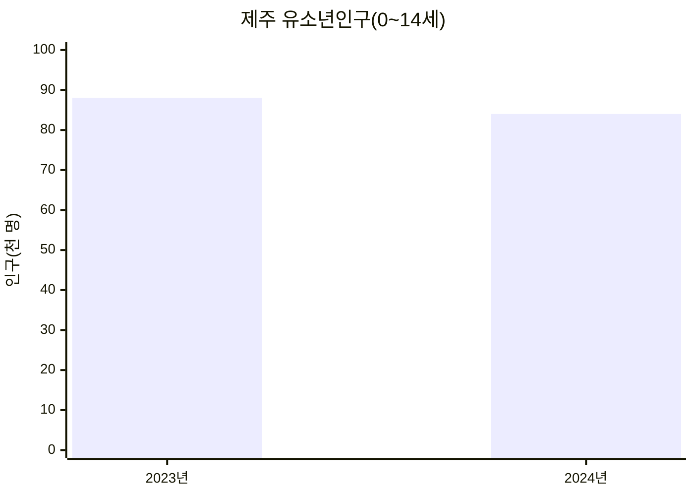
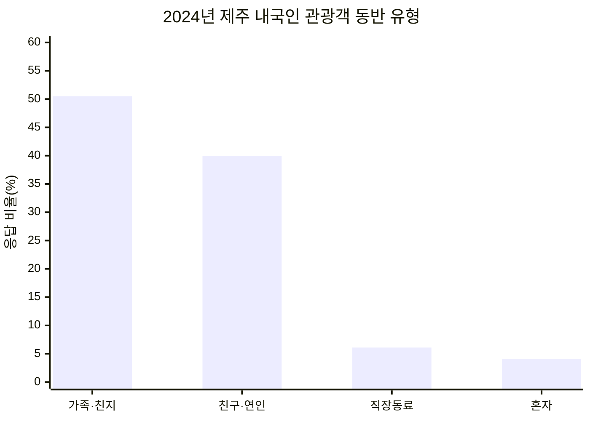
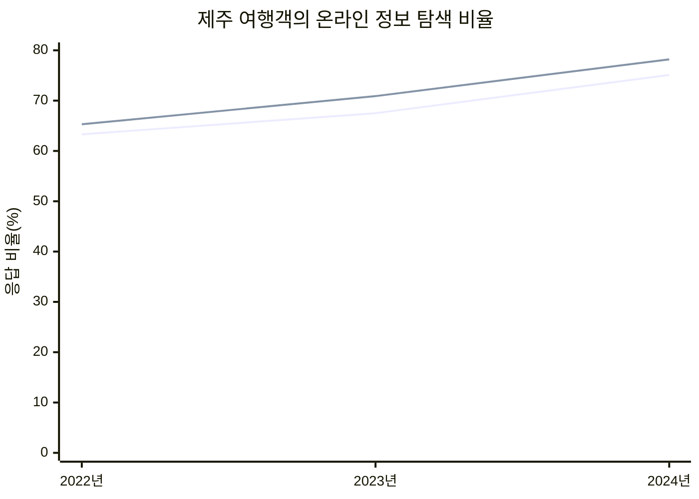
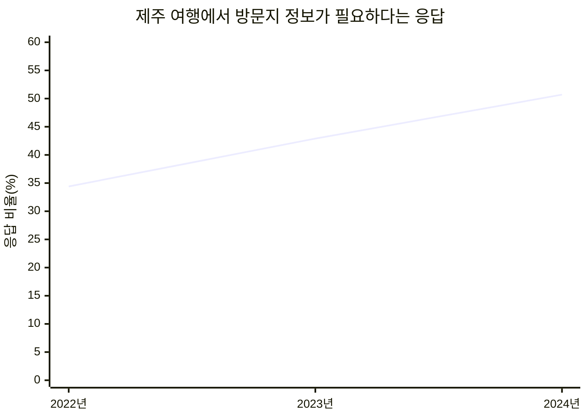

# 제주아이랑 기획 배경

## 1. 문제 정의

제주에서 영유아와 어린 자녀를 동반해 외출하려면 단순히 장소를 찾는 것만으로는 부족합니다. 보호자는 아이의 연령에 적합한지, 실내·실외 공간인지, 유모차를 이용할 수 있는지, 수유실과 기저귀 교환대가 있는지, 주차와 도민 할인이 가능한지까지 함께 확인해야 합니다.

하지만 이러한 정보는 관광 포털, 지도, 블로그, 시설 홈페이지와 예약 사이트 등에 흩어져 있습니다. 보호자는 여러 플랫폼을 오가며 같은 장소를 다시 검색하고 비교해야 하며, 마음에 드는 장소를 찾은 뒤에도 예약 페이지를 별도로 찾아야 합니다.

이 문제는 아이를 키우는 팀원이 제주에서 직접 겪은 경험에서 출발했습니다. 제주아이랑은 **아이 동반 외출에 필요한 정보가 분산되어 의사결정 시간이 길어지는 문제**를 해결하기 위해 기획했습니다.

### 기존 서비스와 한계

현재 보호자는 당근, 인스타그램, 블로그, 맘카페, 지도와 관광 포털 등 여러 플랫폼에서 정보를 각각 검색합니다. 각 서비스는 지역 주민의 후기, 사진 중심 콘텐츠, 상세한 방문 경험, 지도와 운영정보처럼 서로 다른 강점이 있지만, 아이 동반 외출에 필요한 조건을 한 번에 비교하기는 어렵습니다.

| 기존 서비스의 원형 | 주로 얻는 정보 | 아이 동반 장소를 찾을 때 남는 불편 |
|---|---|---|
| 당근·맘카페 | 지역 주민의 추천과 실제 이용 후기 | 게시글마다 정보 형식이 달라 장소별 조건 비교가 어려움 |
| 인스타그램 | 사진과 짧은 영상으로 보는 장소 분위기 | 연령 적합성, 편의시설, 요금과 예약정보를 다시 확인해야 함 |
| 블로그 | 방문 과정과 체험 중심의 상세 후기 | 작성 시점과 기준이 달라 여러 글을 교차 확인해야 함 |
| 지도·관광 포털 | 위치, 운영시간, 연락처와 기본 관광정보 | 수유실, 기저귀 교환대, 유모차, 도민 할인 등 육아 조건이 한곳에 모여 있지 않음 |
| 시설 홈페이지·예약 사이트 | 공식 운영정보와 예약 기능 | 장소를 선택한 뒤 홈페이지나 예약 페이지를 별도로 찾아 이동해야 함 |

**현재는 여러 플랫폼에서 정보를 각각 검색해야 하며, 제주 지역의 아이 동반 장소 정보를 한곳에 모아 조건별로 찾아볼 수 있는 로컬 서비스가 부족합니다.** 제주아이랑은 기존 플랫폼을 대체하기보다 흩어진 장소·육아 편의·이용·예약 정보를 연결해 보호자의 탐색과 비교 과정을 줄이는 역할을 합니다.

---

## 2. 통계 근거

### 2.1 제주 유소년 인구

2024년 제주 유소년인구(0~14세)는 **8만 4천 명**으로, 제주 전체 인구의 **12.4%**였습니다.

| 구분 | 2023년 | 2024년 |
|---|---:|---:|
| 제주 유소년인구 | 8만 8천 명 | 8만 4천 명 |
| 제주 전체 인구 중 비중 | 13.0% | 12.4% |

자료: 국가데이터처, [2024년 인구주택총조사 결과(등록센서스 방식)](https://mods.go.kr/boardDownload.es?bid=510205&list_no=443718&seq=1)

### 2.2 가족 단위 관광

2024년 제주 내국인 관광객의 평균 동반 인원은 **4.4명**이었으며, 동반 유형 중 `가족·친지`가 **50.5%**로 가장 큰 비중을 차지했습니다. 같은 해 제주 방문 관광객은 **1,376만 7천 명**, 내국인 관광객은 **1,186만 2천 명**이었습니다.

| 동반 유형 | 가족·친지 | 친구·연인 | 직장동료 | 혼자 |
|---|---:|---:|---:|---:|
| 응답 비율 | 50.5% | 39.9% | 6.1% | 4.1% |

자료: 제주특별자치도·제주관광공사, 「(11개년도 통합 분석) 2014~2024 제주특별자치도 방문관광객 실태조사」, 슬라이드 13  
관광객 수 자료: 국가데이터처, [2025 통계로 본 제주의 어제와 오늘](https://www.mods.go.kr/board.es?act=view&bid=5148&list_no=442569&mid=a50301010100)

### 2.3 온라인 정보 탐색

2024년 제주 내국인 관광객의 **75.1%**는 여행 정보를 `인터넷 사이트·앱`에서 수집했습니다. 2022년 63.3%에서 2024년 75.1%로 **11.8%p 상승**했습니다. 온라인 정보 수집자 중 `포털사이트 검색` 비중도 2024년 **78.2%**로 가장 높았습니다.

| 항목 | 2022년 | 2023년 | 2024년 | 2년간 변화 |
|---|---:|---:|---:|---:|
| 인터넷 사이트·앱에서 정보 수집 | 63.3% | 67.5% | 75.1% | +11.8%p |
| 온라인 정보 수집자의 포털사이트 검색 | 65.3% | 70.9% | 78.2% | +12.9%p |

자료: 제주특별자치도·제주관광공사, 「(11개년도 통합 분석) 2014~2024 제주특별자치도 방문관광객 실태조사」, 슬라이드 10~11

### 2.4 방문지 정보 수요

제주 여행에서 가장 필요하다고 응답한 정보는 `방문지 정보`였습니다. 해당 비중은 2022년 34.4%에서 2024년 **50.7%**로 **16.3%p 증가**했습니다. 이는 약 47%의 상대 증가로, 개장시간·입장료·여행코스 등 방문 결정에 필요한 정보 수요가 커졌음을 보여줍니다.

| 조사연도 | 2022년 | 2023년 | 2024년 | 2년간 변화 |
|---|---:|---:|---:|---:|
| 방문지 정보 | 34.4% | 42.9% | 50.7% | +16.3%p |

자료: 제주특별자치도·제주관광공사, 「(11개년도 통합 분석) 2014~2024 제주특별자치도 방문관광객 실태조사」, 슬라이드 12

---

## 3. 문제와 타겟

제주에는 아이와 생활하는 보호자와 가족 단위 관광객이라는 분명한 사용자층이 있습니다. 이들은 여행·외출 정보를 주로 온라인과 포털 검색에서 찾고 있으며, 방문지 정보에 대한 수요도 증가하고 있습니다.

그러나 아이 동반 장소를 결정하려면 일반적인 방문지 정보뿐 아니라 아이 연령, 실내·실외 여부, 유모차, 수유실, 기저귀 교환대, 주차, 도민 할인과 예약 여부까지 확인해야 합니다. 이 정보가 여러 플랫폼에 흩어져 있어 보호자가 직접 검색하고 다시 비교해야 한다는 것이 핵심 문제입니다.

> **통계 요약:** 제주 거주 유소년과 가족 단위 관광 수요가 존재하고 온라인 방문지 정보 탐색 비중도 높으므로, 아이 동반 장소 정보를 공통 기준으로 모아 검색·비교할 수 있는 서비스가 필요합니다.

---

## 4. 페르소나

### 4.1 제주 거주 보호자

| 항목 | 내용 |
|---|---|
| 사용자 | 영유아 또는 어린 자녀를 키우는 30~40대 제주 거주 보호자 |
| 상황 | 주말·방학 또는 날씨가 좋지 않은 날에 아이와 갈 장소를 찾음 |
| 목표 | 아이의 연령과 당일 상황에 맞는 장소를 빠르게 결정하고 다음 외출 후보도 저장하고 싶음 |
| 불편 | 지도, 블로그, 맘카페와 시설 홈페이지에서 편의정보를 각각 확인해야 함 |
| 중요 정보 | 지역, 실내·실외, 시설유형, 유모차, 수유실, 기저귀 교환대, 주차, 도민 할인 |

### 4.2 아이 동반 제주 여행객

| 항목 | 내용 |
|---|---|
| 사용자 | 영유아 또는 어린 자녀와 제주를 방문한 30~40대 가족 여행객 |
| 상황 | 정해진 여행 일정과 이동 동선 안에서 아이에게 적합한 장소를 선택해야 함 |
| 목표 | 장소의 운영·요금·주차·예약 정보를 빠르게 비교하고 바로 이동하거나 예약하고 싶음 |
| 불편 | 검색 결과에서 장소를 고른 후 공식 홈페이지와 예약 사이트를 다시 찾아야 함 |
| 중요 정보 | 위치, 운영시간, 입장료, 주차, 아이 편의시설, 홈페이지와 예약 링크 |

---

## 5. 핵심 기능

| 사용자에게 필요한 것 | 제주아이랑의 핵심 기능 |
|---|---|
| 아이와 상황에 맞는 장소를 빠르게 찾기 | 지역·공간·시설유형·연령·육아 편의조건별 검색과 필터 |
| 여러 플랫폼의 정보를 한곳에서 비교하기 | 운영시간·입장료·주차·도민 할인·육아 편의정보를 통합한 장소 상세 화면 |
| 선택한 장소의 공식 정보와 예약 확인하기 | 홈페이지와 예약 페이지 바로가기 |
| 다음 외출 후보를 기억하고 정리하기 | 즐겨찾기, 나만의 카테고리와 메모 |
