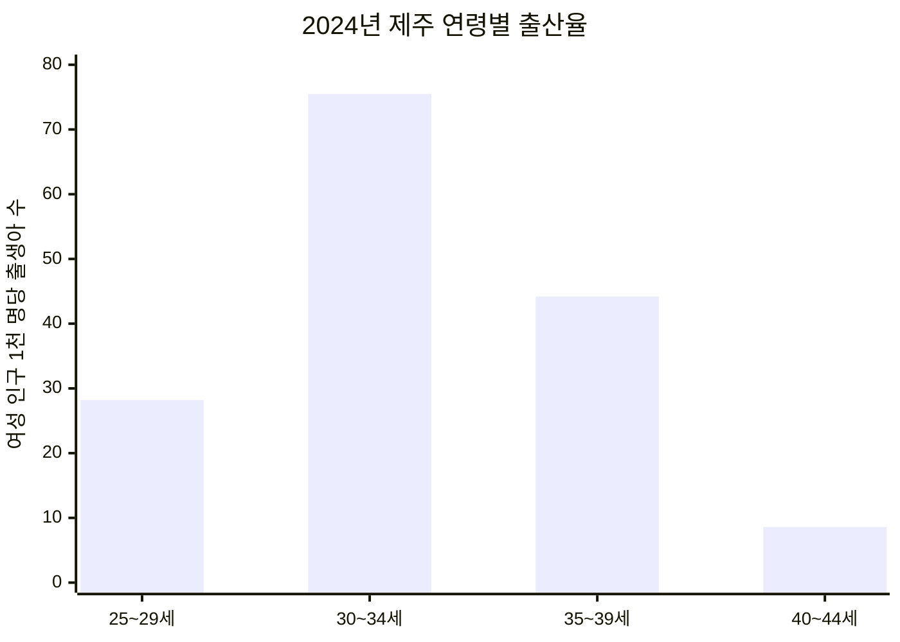
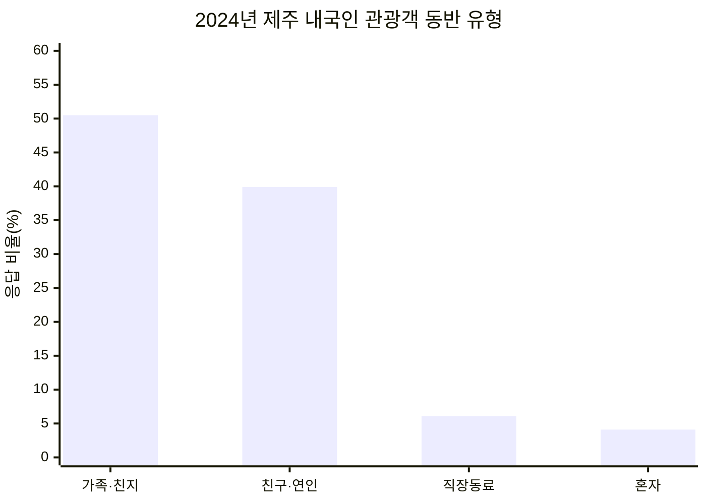
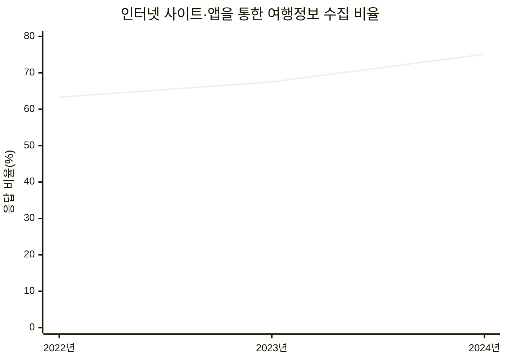
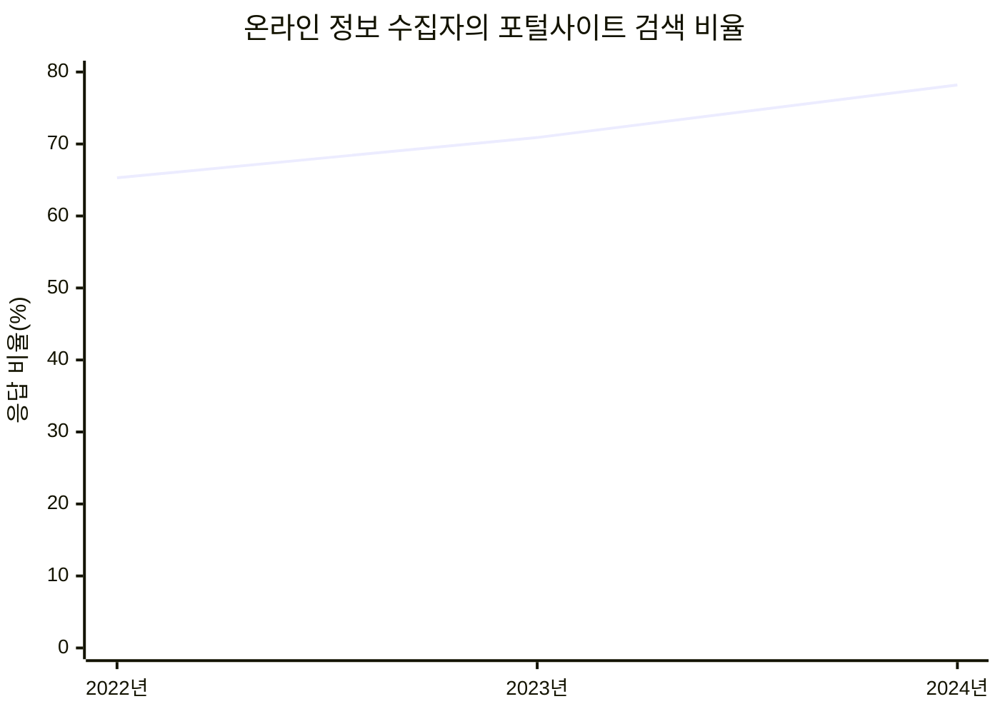
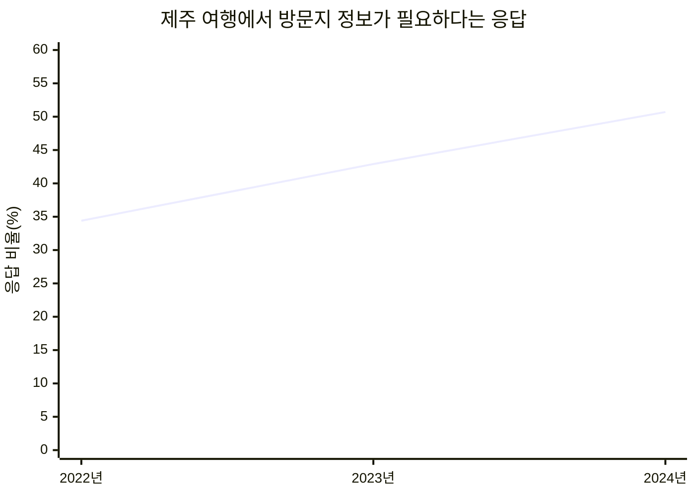

# 제주아이랑 기획 배경

## 문제에서 출발했습니다

제주에서 영유아와 어린 자녀를 동반해 외출하려면 단순히 장소를 찾는 것만으로는 부족합니다. 보호자는 아이의 연령에 적합한지, 실내·실외 공간인지, 유모차를 이용할 수 있는지, 수유실과 기저귀 교환대가 있는지, 주차와 도민 할인이 가능한지까지 함께 확인해야 합니다.

하지만 이러한 정보는 관광 포털, 지도, 블로그, 시설 홈페이지와 예약 사이트 등에 흩어져 있습니다. 보호자는 여러 플랫폼을 오가며 같은 장소를 다시 검색하고 비교해야 하며, 마음에 드는 장소를 찾은 뒤에도 예약 페이지를 별도로 찾아야 합니다.

이 문제는 아이를 키우는 팀원이 제주에서 직접 겪은 경험에서 출발했습니다. 제주아이랑은 **아이 동반 외출에 필요한 정보가 분산되어 의사결정 시간이 길어지는 문제**를 해결하기 위해 기획했습니다.

## 기존 서비스의 원형과 한계

현재 보호자는 당근, 인스타그램, 블로그, 맘카페, 지도와 관광 포털 등 여러 플랫폼에서 정보를 각각 검색합니다. 각 서비스는 지역 주민의 후기, 사진 중심 콘텐츠, 상세한 방문 경험, 지도와 운영정보처럼 서로 다른 강점이 있지만, 아이 동반 외출에 필요한 조건을 한 번에 비교하기는 어렵습니다.

| 기존 서비스의 원형 | 주로 얻는 정보 | 아이 동반 장소를 찾을 때 남는 불편 |
|---|---|---|
| 당근·맘카페 | 지역 주민의 추천과 실제 이용 후기 | 게시글마다 정보 형식이 달라 장소별 조건 비교가 어려움 |
| 인스타그램 | 사진과 짧은 영상으로 보는 장소 분위기 | 연령 적합성, 편의시설, 요금과 예약정보를 다시 확인해야 함 |
| 블로그 | 방문 과정과 체험 중심의 상세 후기 | 작성 시점과 기준이 달라 여러 글을 교차 확인해야 함 |
| 지도·관광 포털 | 위치, 운영시간, 연락처와 기본 관광정보 | 수유실, 기저귀 교환대, 유모차, 도민 할인 등 육아 조건이 한곳에 모여 있지 않음 |
| 시설 홈페이지·예약 사이트 | 공식 운영정보와 예약 기능 | 장소를 선택한 뒤 홈페이지나 예약 페이지를 별도로 찾아 이동해야 함 |

**현재는 여러 플랫폼에서 정보를 각각 검색해야 하며, 제주 지역의 아이 동반 장소 정보를 한곳에 모아 조건별로 찾아볼 수 있는 로컬 서비스가 부족합니다.** 제주아이랑은 기존 플랫폼을 대체하기보다 흩어진 장소·육아 편의·이용·예약 정보를 연결해 보호자의 탐색과 비교 과정을 줄이는 역할을 합니다.

---

# 1단계. 지역·연령·여행행태로 대상을 정의했습니다

## ① 30~40대 보호자

2024년 제주 지역의 모(母) 평균 출산연령은 **33.4세**였습니다. 연령별 출산율은 30~34세가 여성 인구 1천 명당 **75.5명**으로 가장 높았고, 35~39세가 **44.2명**으로 뒤를 이었습니다. 이는 영유아 보호자의 핵심 연령대가 30대를 중심으로 형성되고, 자녀가 성장하면서 40대까지 이어질 가능성이 높다는 근거가 됩니다.

| 연령 | 25~29세 | 30~34세 | 35~39세 | 40~44세 |
|---|---:|---:|---:|---:|
| 출산율(여성 인구 1천 명당) | 28.2명 | 75.5명 | 44.2명 | 8.6명 |

자료: 통계청, [2024년 호남·제주지역 인구동향](https://mods.go.kr/board.es?act=view&bid=5148&list_no=438993&mid=a50301010100)

따라서 제주아이랑의 1차 사용자는 다음과 같이 정의합니다.

> 제주에서 영유아 및 어린 자녀와 함께 외출할 장소를 찾는 30~40대 보호자

## ② 아이 동반 제주 여행객

2024년 제주 내국인 관광객의 평균 동반 인원은 **4.4명**이었으며, 동반 유형 중 `가족·친지`가 **50.5%**로 가장 큰 비중을 차지했습니다. 가족 단위 이동이 가장 대표적인 제주 여행 형태라는 점에서 아이 동반 여행객을 별도의 사용자 집단으로 설정할 수 있습니다.

| 동반 유형 | 가족·친지 | 친구·연인 | 직장동료 | 혼자 |
|---|---:|---:|---:|---:|
| 응답 비율 | 50.5% | 39.9% | 6.1% | 4.1% |

자료: 제주특별자치도·제주관광공사, 「(11개년도 통합 분석) 2014~2024 제주특별자치도 방문관광객 실태조사」, 13쪽

또한 2024년 제주 방문 관광객은 **1,376만 7천 명**이었고, 이 가운데 내국인은 **1,186만 2천 명**이었습니다. 제주 거주 가족뿐 아니라 아이를 동반해 제주를 찾는 여행객도 충분히 큰 잠재 사용자 집단입니다.

자료: 통계청, [2025 통계로 본 제주의 어제와 오늘](https://www.mods.go.kr/board.es?act=view&bid=5148&list_no=442569&mid=a50301010100)

이에 따라 2차 사용자를 다음과 같이 정의합니다.

> 제한된 여행 일정 안에서 아이에게 적합한 제주 장소와 예약 정보를 빠르게 찾으려는 아이 동반 제주 여행객

---

# 2단계. 정보 탐색 행동으로 페르소나를 구체화했습니다

## 통계가 보여주는 행동

2024년 제주 내국인 관광객의 **75.1%**는 여행 정보를 `인터넷 사이트·앱`에서 수집했습니다. 2022년 63.3%에서 2024년 75.1%로 최근 3개 조사연도 동안 **11.8%p 상승**했습니다.

| 조사연도 | 2022년 | 2023년 | 2024년 | 2년간 변화 |
|---|---:|---:|---:|---:|
| 인터넷 사이트·앱 | 63.3% | 67.5% | 75.1% | +11.8%p |

온라인 정보 수집자 중에서는 `포털사이트 검색` 비중이 2024년 **78.2%**로 가장 높았습니다. 이는 제주 여행객 대부분이 검색을 통해 필요한 정보를 직접 조합하고 있음을 보여줍니다.

| 조사연도 | 2022년 | 2023년 | 2024년 | 2년간 변화 |
|---|---:|---:|---:|---:|
| 포털사이트 검색 | 65.3% | 70.9% | 78.2% | +12.9%p |

자료: 제주특별자치도·제주관광공사, 「(11개년도 통합 분석) 2014~2024 제주특별자치도 방문관광객 실태조사」, 10~11쪽

제주 여행에서 가장 필요하다고 응답한 정보는 `방문지 정보`였습니다. 해당 비중은 2022년 34.4%에서 2024년 50.7%로 **16.3%p 증가**했습니다. 이는 약 **47%의 상대 증가**로, 개장시간·입장료·여행코스 등 방문 결정에 필요한 정보 수요가 최근 더욱 커졌음을 의미합니다.

| 조사연도 | 2022년 | 2023년 | 2024년 | 2년간 변화 |
|---|---:|---:|---:|---:|
| 방문지 정보 | 34.4% | 42.9% | 50.7% | +16.3%p |

자료: 제주특별자치도·제주관광공사, 「(11개년도 통합 분석) 2014~2024 제주특별자치도 방문관광객 실태조사」, 12쪽

## 핵심 페르소나

### 제주 거주 보호자

- 30~40대
- 주말이나 방학에 아이와 갈 장소를 반복적으로 탐색
- 날씨와 아이 연령에 따라 실내·실외 장소를 구분해야 함
- 수유실, 유모차, 기저귀 교환대, 주차, 도민 할인 등을 중요하게 확인
- 마음에 든 장소를 다음 외출을 위해 저장하고 싶어 함

### 아이 동반 제주 여행객

- 가족 단위로 제주를 방문
- 제한된 일정 안에서 아이에게 적합한 장소를 빠르게 비교해야 함
- 운영시간, 입장료, 주차, 예약 여부를 함께 확인
- 장소 탐색 후 홈페이지나 예약 사이트를 다시 찾는 과정에서 불편을 느낌

---

# 3단계. 문제와 기능을 연결하는 가설을 세웠습니다

## 핵심 가설

> 가족 단위 제주 여행과 방문지 정보 수요가 크지만, 보호자에게 필요한 육아 편의정보는 여러 플랫폼에 분산되어 있다. 따라서 지역·공간·시설유형·아이 동반 편의조건을 한 화면에서 비교하고 예약까지 연결하면 장소 탐색 과정의 시간과 플랫폼 이동을 줄일 수 있다.

## 페인 포인트와 해결 기능

| 확인된 문제 | 제주아이랑의 해결 방식 |
|---|---|
| 장소 정보가 지도, 블로그, 홈페이지 등에 분산됨 | 제주 장소와 가족 편의정보를 한곳에 통합 |
| 아이 연령과 상황에 적합한지 다시 검색해야 함 | 연령제한, 실내·실외, 시설유형을 조건별로 검색 |
| 유모차·수유실·기저귀 교환대 정보를 따로 확인해야 함 | 육아 편의시설 필터 제공 |
| 주차·입장료·도민 할인을 각각 확인해야 함 | 이용조건을 한 화면에서 비교 |
| 장소를 찾은 뒤 예약 사이트를 다시 검색해야 함 | 상세 화면에서 홈페이지와 예약 페이지로 바로 연결 |
| 찾은 장소를 다시 기억하고 정리하기 어려움 | 즐겨찾기, 나만의 카테고리와 메모 제공 |

## 검증할 서비스 가설

1. 가족 편의조건을 통합 제공하면 적합한 장소를 찾는 시간이 줄어들 것이다.
2. 운영·요금·주차·예약 정보를 한 화면에 제공하면 플랫폼 이동 횟수가 줄어들 것이다.
3. 즐겨찾기와 카테고리를 제공하면 반복적인 장소 검색을 줄일 수 있을 것이다.

---

# 핵심 메시지

> 2024년 제주 내국인 관광객의 50.5%는 가족·친지와 함께 방문했고, 75.1%는 인터넷 사이트와 앱에서 여행 정보를 찾았습니다. 방문지 정보 수요도 2022년 34.4%에서 2024년 50.7%로 증가했습니다. 그러나 아이 동반 보호자에게 필요한 연령, 유모차, 수유실, 주차, 할인, 예약 정보는 여러 플랫폼에 흩어져 있습니다. 제주아이랑은 이 정보를 한곳에서 검색·비교·저장하고 예약까지 연결해 보호자의 탐색 부담을 줄이는 서비스입니다.
